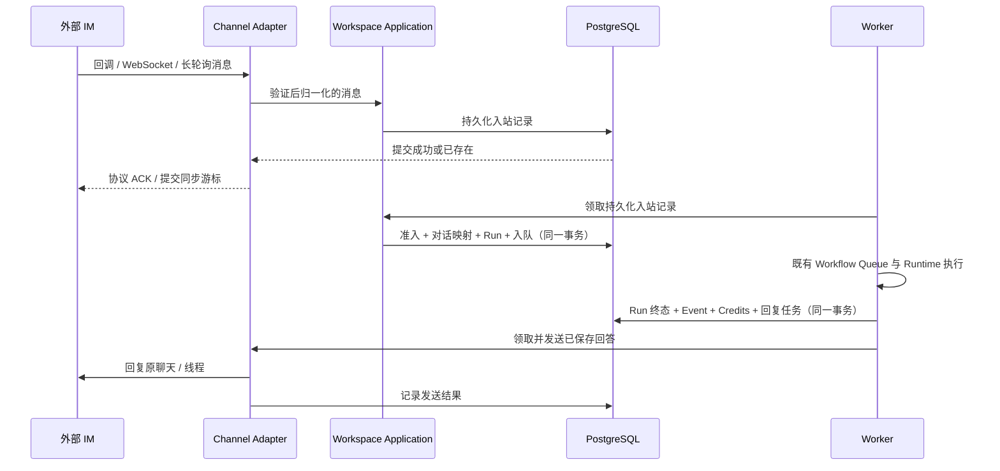

# Workflow Message Channel 接入设计

状态：2026-10-03 设计提案。需求范围来自产品规格 §5.7；下列接口、默认值、Schema 和批次尚未实现，不能作为渠道可用或生产验收证据。当前代码基线为 `fe5c8bb`。

需求跟踪：[Issue #62](https://github.com/owl-go/agent-platform/issues/62)；实施顺序见 [执行计划](../tickets/workflow-message-channels-execution.md)。

## 1. 目标与现状

闭环是「外部聊天问题 → Workflow → Run → 原聊天回答」，同时支持连续追问。渠道属于 Workflow 配置，不是 Agent 调用的 MCP/CLI Connector，也不依赖特定 Runtime Engine 的内置聊天插件。

已检查的现有 seam：

| 位置 | 现有行为 | 需要增补 |
|---|---|---|
| `backend/internal/biz/workspace/domain/model.go` | Workflow、Run、冻结执行配置 | 渠道配置、来源与回复状态领域契约 |
| `backend/internal/biz/workspace/application/service.go` | Repository 的 CreateRun/ContinueRunConversation | 渠道准入与原子幂等入队用例 |
| `backend/internal/data/workspace/gormrepo/workflows.go` | Workflow FIFO、初始 Run、连续追问 | 渠道入站事务；现有 CreateRun 只接受 manual/scheduled/api，追问写入 manual，不能原样复用成渠道触发 |
| `backend/internal/service/workspace/workflows.go` | OIDC/Workflow JWT、Credits、依赖校验 | owner 管理 API 与独立供应商回调入口 |
| `backend/cmd/worker`、`backend/internal/data/workspace` | 持久化领取、Runtime 执行、终态落库 | 有界渠道连接与发送任务、恢复、停用对账 |
| `frontend/src/pages/WorkflowDetailPage.vue` | 设置、历史、Run Conversation | 消息渠道分组、接入验证与回复失败恢复 |

本轮没有修改上述实现、Proto、Migration 或 UI。已有飞书/钉钉 CLI Connector、Workflow API 和 Runtime 品牌能力，都不能证明消息渠道已经可用。

## 2. 平台处理链路



API 只认证、验证、持久化和快速 ACK，不在回调期限内等待模型。长连接与轮询由 Worker 下的独立有界循环维护，不能占据某个 Run 的执行生命周期。沿用当前 Worker 进程所有权机制；每个渠道账号增加持久化 lease 与 fencing generation，避免两份连接、过期持有者提交游标或旧凭证任务继续发送。停机先停止领取再关闭连接，所有长操作传播 `context.Context`。

Workspace Domain/Application 定义消息与发送 port；供应商 HTTP/WebSocket/JSON-RPC 实现在 Data Adapter。建议新增 `backend/internal/data/messagechannel`，公共归一化、限流和脱敏只做一份。不要给 `agentruntime.Adapter` 增加 IM 方法，也不要让渠道 Adapter 管理 Docker、Credits 或直接创建 Run。

Signal 与 BlueBubbles 使用专用外部 Bridge；平台只连接受信 Bridge 端点。Signal 账号密钥和 iMessage/Mac 环境不进入 Runtime 镜像；平台 Worker 不扫描宿主机聊天数据库。OpenClaw 插件可作协议核查来源或受控 Bridge 候选，不能成为“必须选 OpenClaw 才能收消息”的产品约束。

## 3. 建议契约与持久化

| 契约 | 最小字段或职责 |
|---|---|
| Workflow Message Channel | id、owner、workflow、provider、region、非敏感 account/tenant identity、audience、enabled、config_version、credential_version、validation、connection health |
| 受保护渠道凭证 | 绑定 owner/channel/version 的密文；bot token、app secret、签名密钥、reply context/session webhook 等临时回复能力分别管理 |
| 归一化入站消息 | channel、account/tenant、external_event_id、external_message_id、sender_id、chat_id、chat_kind、thread/topic、received_at、text、is_bot、mention、受保护 reply target reference |
| Message Channel Conversation | owner/workflow/channel、外部 conversation key、conversation generation、根 Run ID；sender 属于隔离 key |
| 入站记录 | dedup key、归一化消息、received/admitted/rejected/ignored 状态、原因、Run ID、lease/version |
| Message Channel Delivery | channel、Run 或入站记录、kind（answer/status）、destination reference、config/audience revision、不可变已脱敏 payload、chunk 顺序、state、attempt、retry_at、deadline、provider message ID |

建议 provider 枚举：`telegram`、`discord`、`slack`、`matrix`、`whatsapp`、`signal`、`dingtalk`、`feishu`（region 为 feishu/lark）、`wecom`、`wechat`、`qqbot`、`bluebubbles`、`yuanbao`。每个 Adapter 返回非 Runtime 的渠道能力描述：direct/group、thread/topic、mention、text、可验证发送幂等、回复期限、最大消息长度、接收 transport、可选 encrypted_room/media/edit/stream。缺证据的可选能力默认关闭。

数据库使用新增不可变 Migration，不改写旧 Run Snapshot 或历史 trigger。管理 JSON API 仍以 `backend/api/workspace/v1/workspace.proto` 为权威来源；第三方签名回调是有意的自定义 Handler。建议 owner-only API：

- `GET/POST /api/v1/workflows/{workflow_id}/message-channels`：列出与创建关闭状态配置。
- `GET/PATCH/DELETE /api/v1/workflows/{workflow_id}/message-channels/{channel_id}`：读取非敏感投影、Version CAS 更新/删除；Secret 替换单独接收写入。
- `POST .../{channel_id}/validation`、`GET .../{channel_id}/validation`：开始测试窗口、读取当前配置版本的真实收发验证结果。
- `POST .../{channel_id}/enable`、`POST .../{channel_id}/disable`：独立管理配置启用状态；临时断线是 health 状态，不等于配置被关闭。
- `POST .../{channel_id}/conversations/{conversation_id}/reset`：由 owner 切换 conversation generation；已接收消息保留原 generation。
- `GET .../{channel_id}/deliveries`、`POST .../{channel_id}/deliveries/{delivery_id}/retry`：仅恢复发送；重新执行仍使用既有 Run 操作。
- `POST /api/v1/message-channel-callbacks/{provider}/{opaque_channel_id}`：仅允许 Adapter 的供应商验证，不接受 OIDC/Workflow JWT 代替供应商认证；路径不可预测性不替代签名校验。

二维码/设备授权需要单独短期状态接口，只有 owner 可查看；二维码及临时 Token 不进入普通日志。Callback challenge 不创建 Run。管理错误与未知资源保持 owner-scoped Not Found 语义。

## 4. 准入、连续性与隔离

1. Adapter 按官方协议校验原始 body、签名/Secret、时间窗口、连接账号归属；限制 body 和文本大小。归一化字段不能接受消息中自报的 owner/workflow/credential identity。
2. 同一供应商接收身份及其事件覆盖范围只允许一个活动绑定；例如同一 Bot 的全量消息流不能同时绑定两条 Workflow。发布订阅本就支持分区时，只有经过验证的互斥范围才可例外；首期不做跨 Workflow 路由。
3. 配置保存为关闭；validation 使用独立临时测试受众和固定测试回复，不运行模型、读取 Workspace/知识或收费。owner 在真实 IM 发测试消息，平台回原聊天，保存 inbound 与 outbound 证据。验证通过只说明该范围与文本链路；配置/凭证/受众变化使验证失效。
4. 启用要求 passing validation、enabled owner、有效 Workflow、当前执行配置/依赖以及明确非空受众。建议私聊 sender allowlist；群聊同时限定 chat allowlist 与 sender allowlist，并默认 require_mention。首期不支持公开匿名受众、用户名显示名匹配或自动接受新群邀请。
5. 忽略自身、其他 Bot、发送回声、编辑/删除/已读/typing 等非首发用户文本事件。无可信 mention 的群能力不启用。Adapter 若不提供安全稳定的消息身份，则在证明合成身份无碰撞前不开放执行。
6. HTTP ACK 只在入站记录提交后发送；供应商游标同样在整批入站提交后推进。重复消息返回既有记录。准入事务锁定 channel/config version 与 Workflow，重新检查受众、账号、依赖、Credits 和队列后，再创建/锁定对话映射、创建 Run、写事件及 admitted 关联。不能先创建 Run 再补 dedup。后续 Run 的 trigger 明确为 `message_channel`，保留 root provenance。
7. conversation key 为 owner + workflow + channel + account/tenant + chat + thread/topic（无则为空）+ sender + generation。以已认证外部 ID 构造，禁止按名称或手机号字符串跨渠道合并；WhatsApp 应兼容其业务作用域用户标识而非假设永远有手机号。
8. 先按服务端持久化接收顺序处理入站，再按 Workflow 的既有入队顺序执行；不声称能恢复供应商未提供的原始顺序。连续追问使用已完成的先前回合；失败、取消和明确未执行的先前回合不伪造回答。`reset` 前后分别映射不同根 Run，旧已接收事件仍属于旧对话。
9. 首个 Run 冻结 Workflow Snapshot；后续保持其 goal/environment，按当前 Personal Settings 冻结 Runtime/Model，沿用对话的 specialist/resource selection。外部消息只有 text input，不允许提交 selection ID、任意附件路径、资源 ID、模型或 Runtime 指令字段。owner 在平台修改某 Run Conversation 的选择遵循现有规则，不改变渠道受众授权。
10. 受众授权意味着运行 owner 所配置的 Workflow；新增启用说明必须明确共享 Workspace、知识和外部操作的影响。不要把隔离 conversation key 当作文件级隐私保证。需要参与者文件隔离的场景使用独立 Workflow；首期不自动把私有 Artifact/引用下载 URL 发到外部。

队列满、Credits 不足、依赖不可用和非法输入进入 durable rejected，创建有界 status Delivery，不占 Run 槽、不自动重新执行，也不无限等待队列腾空。事件重试读取相同 rejection；参与者下一次主动发送的新问题才是新请求。未授权事件只记录最小安全元数据并忽略，不把存在性、资源详情或余额发给对方。接收 backlog、每 sender/channel 速率、文本大小和租约时长由严格 YAML 设置正数上限，具体值在 WMC-01 负载验证时固定。

渠道不请求模型 Plan 确认。Connector 授权缺失或高风险操作仍通过既有 User Action Wait 暂停，只向 IM 返回不含私有操作细节的“等待工作流拥有者处理”；只有 owner 的 OIDC 身份可审批，超时收口。外部回复“同意”没有审批效力。

## 5. 回复事务与恢复

Run 最终状态、唯一终态 Event、Credit settlement 与 answer/status Delivery 在同一 Repository 事务提交。若终态需通过多个写入 seam 完成，先统一事务 port；严禁模型已结算但永久丢失回复任务。Delivery Worker 只读已持久化、经过公共 Secret 脱敏的最终答案，不订阅 Runtime 原始 stdout/stderr 来拼答复。无 final_text 时使用明确 final_json 的安全文本编码；两者皆空则返回完成但无文本结果的固定状态，不凭空生成答案。

```text
pending → sending → sent
                  → retry_wait → sending
                  → failed | expired | outcome_unknown
pending / retry_wait → cancelled
```

`sent` 表示供应商确认接受发送，不保证用户已读。`outcome_unknown` 表示超时、连接中断或发送后崩溃，无法确认是否已经发送；只在渠道证明支持稳定幂等 key 或可查询确认时自动恢复。否则展示未知结果，由 owner 决定是否再次发送并承担可能重复的结果，不能声称跨所有 IM exactly-once delivery。Run 的 admitted identity 与 Credits settlement 仍需 exactly-once。

答案按 Adapter 的实际字符/字节限制拆分，每个 chunk 有稳定 key 和独立状态；从失败 chunk 恢复，保持同一对话消息顺序。后一个 Run 的答复不得越过前一个未决 Delivery；前一个明确 failed/expired/cancelled 后允许后一个继续，unknown 由 owner 解决或显式跳过。无原生线程的群渠道回复原群并注明当前提问者，不自动开启与陌生人的私聊；不能把另一 sender 的先前回答写入模型上下文。

发送前重查 owner、Workflow、channel enabled、当前受众、目标身份及 config/credential version。轮换只能为经过复验的同一账号使用新凭证；账号或 region 变化先停用、取消旧未发 Delivery，并建立新 conversation generation，绝不能把旧答复送给新账号。撤销受众取消对应未发答复与非终态 Run。重复启用不能复活被 cancelled 的旧任务。

重试遵守 Retry-After、带抖动退避、次数上限和 provider reply deadline；临时 session webhook/context token 按其验证范围与期限使用，过期不转成任意主动发送。状态提示也占用渠道回复次数预算，不能耗尽最终答复机会。重发已保存答案不调用模型、不新增 Credit Consumption；owner 明确 rerun 才创建新的执行，并在仍有发送授权时关联新的 Delivery。

停用/删除/owner disable 与领取、Run admission、发送状态转换使用同一版本锁/栅栏边界。已提交网络发送无法撤回；该例外保留脱敏结果但不再领取、续连、重新发送。正常恢复不得重新开启已终态 Run。入站 tombstone 建议至少保留 30 天且不短于渠道验证的最大重放窗口；过期外部旧消息拒绝准入，避免 tombstone 清理后重跑。具体正文保留、删除和 tombstone 期限在数据生命周期验收中固定；正文永不进入普通审计或指标。

## 6. 凭证、网络与观测

- 复用平台加密边界，AAD 包含 owner/channel/credential version。渠道密钥、短期回复地址/Token 及游标中的敏感部分不进入普通 Snapshot、Runtime env、Artifact、URL 日志或 error cause；诊断仅返回稳定分类和脱敏 cause。
- 供应商域名采用 allowlist，出站 HTTPS 校验证书、重定向和解析后的地址；自托管 Matrix/Bridge 使用 Administrator 配置的精确服务端网络 allowlist，不接受外部消息提供的 URL。批准的私网 Bridge 仅在渠道服务网络访问，不能扩大 Sandbox 的 Egress 权限。BlueBubbles 密码可能在 query 中，HTTP Client 与代理必须屏蔽整段敏感 query。
- callback secret 不能代替 WebSocket 官方握手验证；没有原生可信 webhook 签名的 Bridge 通过受控 relay 增加双向认证与防重放，不能把无认证 webhook 直接公开。
- 只记录连接状态、安全错误 code、耗时、消息/拒绝/重试计数与私有 Run 关联。Product Event 与 Governance Audit Event 不含 sender、chat ID、消息正文、答案、Token 或签名 URL；owner 的私有渠道详情可以查看受保护的来源与 Delivery 状态。

## 7. 渠道核查与推荐批次

下表是截至 2026-10-03 阅读一手文档后的接入候选。每行均为“本平台未实现、未真实收发验收”。B1/B2/B3 是建议优先级，不是发布日期或对所有账号可用的承诺。

| 渠道 | 建议接收 / 回复方式 | 前置条件与边界 | 批次 / 一手依据 |
|---|---|---|---|
| Telegram | Bot API Webhook / sendMessage；轮询为后续 transport | bot token、Webhook Secret；群 privacy/topic 范围需实测，Webhook 与 getUpdates 不能并用 | B1；[Bot API](https://core.telegram.org/bots/api) |
| Discord | Gateway MESSAGE_CREATE / REST 消息回复 | Bot token、DM/Guild intents、权限；普通群消息内容涉及 Message Content privileged intent，不能用普通 Incoming Webhook 接收聊天 | B1；[Gateway](https://docs.discord.com/developers/events/gateway) |
| Slack | Events API / chat.postMessage；Socket Mode 为后续 transport | Bot OAuth scopes、Signing Secret、tenant/thread；签名 body 保留，3 秒 ACK 与重复 event_id；不能仅配置 Incoming Webhook | B1；[Events API](https://docs.slack.dev/apis/events-api/)、[签名](https://docs.slack.dev/authentication/verifying-requests-from-slack/)、[发送](https://docs.slack.dev/reference/methods/chat.postMessage/) |
| Matrix | Client-Server /sync / room send（txnId） | 独立账号、homeserver、access token；首次 sync 不回灌历史成新问题；加密房间须独立实现设备密钥与验证，否则拒绝 | B2；[Client-Server API](https://spec.matrix.org/latest/client-server-api/)、[E2EE](https://matrix.org/docs/matrix-concepts/end-to-end-encryption/) |
| WhatsApp | Business Platform Cloud API Webhook / messages | Business 账号、发送身份与应用权限；24 小时窗口与模板、人工升级路径、地区及账号资格和现行 AI 接入条款须核查；不把个人账号自动化当官方 Cloud API | B2，资格先于开发；[Meta Webhooks](https://www.postman.com/meta/whatsapp-business-platform/folder/lboq68h/webhooks)、[消息政策](https://whatsappbusiness.com/policy/)、[现行条款入口](https://www.whatsapp.com/legal/meta-terms-whatsapp-business) |
| Signal | signal-cli JSON-RPC receive / send，独立 Bridge | 第三方非官方工具；注册/linked device、定期接收、账号密钥持久化与版本维护；桥接掉线/重启丢失通知窗口需验证 | B3；[项目说明](https://github.com/AsamK/signal-cli)、[JSON-RPC](https://github.com/AsamK/signal-cli/blob/master/man/signal-cli-jsonrpc.5.adoc) |
| DingTalk（钉钉） | 应用机器人 Stream / session webhook 或官方发送 API | App Client ID/Secret、应用可用范围；区分应用机器人与单向自定义群机器人，短期回复地址期限与主动发送权限需核查 | B1；[Stream](https://open-dingtalk.github.io/developerpedia/docs/explore/tutorials/stream/overview/)、[回复](https://open-dingtalk.github.io/developerpedia/docs/learn/bot/appbot/reply/) |
| Feishu/Lark（飞书） | 官方 SDK 长连接 im.message.receive_v1 / im message/reply API | 应用机器人、App ID/Secret、事件与群 @/私聊权限；显式 region，外部群和可用范围需单独验证 | B1；[官方 Go SDK](https://github.com/larksuite/oapi-sdk-go)、[消息权限与场景](https://open.feishu.cn/solutions/detail/ticket?lang=zh-CN)、[接收事件](https://open.feishu.cn/document/server-docs/im-v1/message/events/receive) |
| WeCom（企业微信） | API 模式智能机器人 WebSocket / 对应答复协议 | Bot ID/Secret、企业功能入口、连接独占与回复期限；与传统发送型群 webhook、自建企业应用回调区分 | B2；[腾讯官方长连接接入说明](https://cloud.tencent.com/document/product/1831/137051) |
| WeChat（微信） | 腾讯 iLink Bot QR 授权、getupdates 长轮询 / sendmessage | 从腾讯公开插件与协议核查直连资格；Bot token、context_token、返回 baseurl 的可信域校验；先验证支持的私聊范围，不凭 group_id 字段承诺群聊；公众号不是同一账号入口 | B2，资格与协议验证先行；[腾讯插件](https://github.com/Tencent/openclaw-weixin)、[协议](https://github.com/Tencent/openclaw-weixin/blob/main/docs/protocol_zh_CN.md) |
| QQ Bot | 官方机器人消息订阅 / API v2 被动回复 | AppID/AppSecret、Access Token、审核与可用范围；单聊/群聊/频道分别验证，官方发送文档对旧主动额度与停用公告存在并列描述，按现行被动回复窗口验收，不承诺主动推送 | B2；[接入](https://bot.q.qq.com/wiki/develop/api-v2/)、[官方发送源文档](https://github.com/tencent-connect/bot-docs/blob/main/docs/develop/api-v2/server-inter/message/send-receive/send.md) |
| BlueBubbles（iMessage） | BlueBubbles new-message webhook / REST，独立 Bridge | 常驻 macOS、已登录 iMessage、系统权限、Server Secret；第三方桥接，非 Apple 通用 Bot API；无必要不启用 Private API | B3；[Server](https://docs.bluebubbles.app/server)、[REST/Webhooks](https://docs.bluebubbles.app/server/developer-guides/rest-api-and-webhooks) |
| Yuanbao（元宝） | 元宝 Bot WebSocket 收发；先核查直连协议或独立 Bridge | OpenClaw 官方渠道资料把 openclaw-plugin-yuanbao 归为腾讯元宝团队维护的外部插件；AppKey/AppSecret、Bot 开通资格、私聊/群 @、固定包完整性与重连需核查。该资料明确未按核心源码验证插件行为，不能照抄其 production-ready 为本平台证据 | B2，协议验证先行；[渠道资料](https://docs.openclaw.ai/channels/yuanbao)、[官方外部插件目录源](https://github.com/openclaw/openclaw/blob/main/scripts/lib/official-external-channel-seed.json) |

WhatsApp 文档部分被 429 或登录重定向阻挡，本轮只验证到 Meta 发布的 Webhook 说明与当前消息政策；未确认登录后的完整现行 AI 接入条款，不引用旧新闻作当前许可结论。飞书接收事件页为动态页面，具体实现须结合官方 SDK 与可读取的事件 Schema 再核查。企业微信采用腾讯官方产品接入说明作为可读取依据；底层原始协议、超时与重连仍列为开发前验证项。

## 8. 验收边界

所有渠道先满足共享 fake/recording Adapter Suite，再提供每个供应商实际账号的独立证据。最低闭环是两次真实提问/连续追问、正确原聊天回复、owner Run History 对应记录及 Credit settlement；不以发送 API 成功、接收连接在线或单次固定测试回复替代执行闭环。

共享用例至少覆盖：签名与原始 body、防重放、tenant/owner 隔离、allowlist 与 @、Bot 回声、dedup 并发、初始/追问/reset、Snapshot 延续、共享 Workspace 边界、五个 queue 槽、Credits、依赖撤销、owner disable、停用与发送竞态、终态/Outbox 原子性、已发送与 unknown 的重启恢复、chunk 顺序/部分发送、限流/期限、轮换换号、防 SSRF、精确 Secret 脱敏、审批截止以及回复重试不重新扣费。

每条证据记录 channel/provider、adapter revision、应用范围和权限、接收 transport、非敏感测试步骤、真实结果、执行/发送/结算记录、已验证及拒绝能力。真实外部 ID 只保留在 owner 私有记录，仓库证据使用一致别名；不记录 Bot token、App Secret、context_token、手机号、原始 webhook、私人问题、签名 URL 或二维码。Runtime Capability 仍须其既有 Digest Conformance，不能用渠道验收替代。
