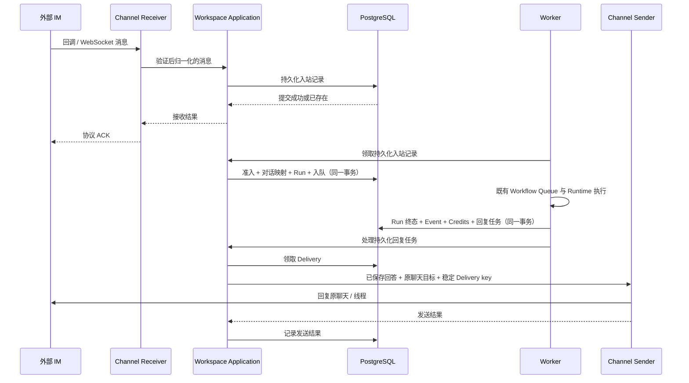

# Workflow Message Channel 接入设计

状态：2026-10-03 全部 13 个渠道的文本收发 Adapter 与配置界面已实现，待真实账号与生产验收。用户在完成首批五个渠道后要求其他渠道一起实施。开发分支为 `codex/workflow-message-channels`；本地 recording Adapter、PostgreSQL 和构建证据不能作为真实 IM 可用证据。

需求跟踪：[Issue #62](https://github.com/owl-go/agent-platform/issues/62)；实施顺序见 [执行计划](../tickets/workflow-message-channels-execution.md)。

## 1. 目标与现状

闭环是「外部聊天问题 → Workflow → Run → 原聊天回答」，同时支持连续追问。渠道属于 Workflow 配置，不是 Agent 调用的 MCP/CLI Connector，也不依赖特定 Runtime Engine 的内置聊天插件。

已检查的现有 seam：

| 位置 | 现有行为 | 需要增补 |
|---|---|---|
| `backend/internal/biz/workspace/domain/model.go` | Workflow、Run、冻结执行配置 | 渠道配置、来源与回复状态领域契约 |
| `backend/internal/biz/workspace/application/service.go` | Repository 的 CreateRun/ContinueRunConversation | 渠道准入与原子幂等入队用例 |
| `backend/internal/data/workspace/gormrepo/workflows.go` | Workflow FIFO、初始 Run、连续追问 | 渠道入站事务；现有 CreateRun 只接受 manual/scheduled/api，追问写入 manual，不能原样复用成渠道触发 |
| `backend/internal/service/workspace/workflows.go` | OIDC/Workflow JWT、Credits、依赖校验 | owner 管理 API 与独立供应商回调入口 |
| `backend/cmd/worker`、`backend/internal/data/workspace` | 持久化领取、Runtime 执行、终态落库 | 有界渠道连接与发送任务、恢复、停用对账 |
| `frontend/src/pages/WorkflowDetailPage.vue` | 设置、历史、Run Conversation | 消息渠道分组、接入验证与回复失败恢复 |

上述 seam 已增补消息渠道实现、Proto/生成类型、Migration `000066` / `000067` 和第六个 Settings 分组。已有 CLI Connector 与 Workflow API 仍是独立能力；本轮未取得真实应用、Runtime 和 IM 的端到端验收。

## 2. 平台处理链路



API 只认证、验证、持久化和快速 ACK，不在回调期限内等待模型。长连接与轮询由 Worker 下的独立有界循环维护，不能占据某个 Run 的执行生命周期。首期沿用当前 Worker 的进程级 PostgreSQL Advisory Lock，不另建每渠道连接租约。Supervisor 按 Channel Version 取消过期连接，数据库准入与发送重查 Config Version；只有发送任务持有持久化 UUID lease。长连接随循环的 `context.Context` 关闭，所有权查询失败也取消现有连接。SDK 内部重连不能绕过停用：钉钉采用平台管理的 Stream 连接与官方 frame 类型；Discord/飞书使用固定 SDK 的受控生命周期。

Workspace Domain 定义归一化消息；Application 的 `message_channel_transport.go` 分别定义账号识别、消息接收和消息发送 port，供应商实现在 `backend/internal/data/messagechannel`。每个渠道通过 `ChannelTransport` 显式注册以下角色，可以由同一实现或不同实现提供：

| Interface | 职责与约束 |
|---|---|
| `ChannelAccount` | `Identify` 认证配置凭证并取得稳定账号/tenant identity，不接收或发送消息 |
| `ChannelReceiver` | `Configure` 校验接收身份并准备运输设置；实际接收选择下面一种 Interface |
| `ChannelWebhookReceiver` | 认证原始 HTTP 请求并返回归一化消息/协议响应；Application 完成 Inbox 持久化后才返回响应 |
| `ChannelStreamReceiver` | `Connect` 管理受 `context.Context` 控制的长连接，通过 `ChannelMessageSink` 提交归一化消息；sink 失败不得成功 ACK，消息 deadline 必须传播到持久化 |
| `ChannelSender` | `Send` 使用保存的答案、原聊天目标和稳定 Delivery key，返回安全发送状态；不执行模型或调用接收器 |

Telegram/Slack/WhatsApp 注册 Webhook 接收器，其余渠道注册长连接或轮询接收器；13 个渠道各自实现发送 Interface，不再需要实现不支持的 Webhook 方法。公共接收和发送循环仅依赖自己的角色；保存/验证配置要求账号、发送器和唯一接收方式齐备，缺少或同时注册两种接收方式的配置不开放。注册在进程启动时固定，Application 持有注册表副本；它是静态运输装配，不是产品动态 Capability 注册表。HTTP 认证绕过仍由 Service 的精确 Telegram/Slack/WhatsApp POST 及 WhatsApp GET 验证路由限制，新渠道不能仅靠注册自动开放公开入口。

供应商认证、消息解析与归一化由各自 Receiver 完成，入站准入、限流、脱敏、工作流执行和 Delivery 恢复复用公共链路。不要给 `agentruntime.Adapter` 增加 IM 方法，也不要让渠道 Adapter 管理 Docker、Credits 或直接创建 Run。

Signal 与 BlueBubbles 使用专用外部 Bridge；平台只连接受信 Bridge 端点。Signal 账号密钥和 iMessage/Mac 环境不进入 Runtime 镜像；平台 Worker 不扫描宿主机聊天数据库。OpenClaw 插件可作协议核查来源或受控 Bridge 候选，不能成为“必须选 OpenClaw 才能收消息”的产品约束。

## 3. 契约与持久化

| 契约 | 最小字段或职责 |
|---|---|
| Workflow Message Channel | id、owner、workflow、provider、region、非敏感 account/tenant identity、audience、enabled、config_version、credential_version、validation、connection health |
| 受保护渠道凭证 | 绑定 owner/channel/version 的密文；bot token、app secret、签名密钥、reply context/session webhook 等临时回复能力分别管理 |
| 归一化入站消息 | channel、account/tenant、external_event_id、external_message_id、sender_id、chat_id、chat_kind、thread/topic、received_at、text、is_bot、mention、受保护 reply target reference |
| Message Channel Conversation | owner/workflow/channel、外部 conversation key、conversation generation、根 Run ID；sender 属于隔离 key |
| 入站记录 | dedup key、归一化消息、received/admitted/rejected/ignored 状态、原因、Run ID、Config Version、generation、带 revision 的非敏感 reaction/card message ID 与创建状态 |
| Message Channel Delivery | channel、Run 或入站记录、kind（answer/status/validation/waiting）、destination reference、config/audience revision、不可变已脱敏 payload、chunk 顺序、state、attempt、retry_at、deadline、provider message ID |

完整目标的 provider 枚举：`telegram`、`discord`、`slack`、`matrix`、`whatsapp`、`signal`、`dingtalk`、`feishu`（region 为 feishu/lark）、`wecom`、`wechat`、`qqbot`、`bluebubbles`、`yuanbao`。全部枚举均有文本 Adapter，具体私聊、群 @ 与运输边界见下表；保存后仍须当前账号真实收发验证才能启用。未实现通用动态 Capability 注册表；媒体、加密房间与编辑执行均不开放。

数据库使用新增不可变 Migration，不改写旧 Run Snapshot 或历史 trigger。管理 JSON API 仍以 `backend/api/workspace/v1/workspace.proto` 为权威来源；第三方签名回调是有意的自定义 Handler。当前 owner-only API：

- `GET /api/v1/workflows/{workflow_id}/message-channels`：返回非敏感配置和平台 `available` 开关。
- `POST` 同一路径：新建关闭状态配置；传 `channel_id` 和 `version` 更新已有配置。启用时禁止编辑，凭证写入不回显；全部留空沿用已有凭证，替换时提供完整凭证。
- `POST .../{channel_id}/actions`：Version CAS 控制 `validate`、`enable`、`disable`、`delete`、`reset`。reset 切换整个渠道的 generation，已接收消息保留原 generation。
- `GET .../{channel_id}/deliveries`、`POST .../{channel_id}/deliveries/{delivery_id}/retry`：最多展示最近 100 个发送记录；只恢复已保存的回答，unknown 重发要求 `confirm_possible_duplicate=true`。
- `POST /api/v1/message-channel-callbacks/{provider}/{channel_id}`：只开放 Telegram、Slack、WhatsApp 的供应商认证（历史 QQ 回调路由不再注册接收器，拒绝请求），不能用 OIDC/Workflow JWT 代替；路径不可预测性不替代签名。Body 上限 64 KiB，认证失败返回 401，持久化/处理失败返回 503，超过上限返回 413。

账号接入与受众/收发验证分开。`ChannelAccount` 可选实现 `ChannelQRLogin`，扫码能力不混入接收/发送接口。微信使用 [腾讯 iLink QR 协议](https://github.com/Tencent/openclaw-weixin/blob/main/docs/protocol.md)；QQ 使用腾讯发布的 [`@tencent-connect/qqbot-connector` 1.2.0](https://www.npmjs.com/package/@tencent-connect/qqbot-connector) 的绑定协议，创建任务时生成 32 字节随机 AES-GCM Key，确认时验证并解密 App Secret。QQ 使用官方 WebSocket Gateway 接收；扫码是机器人绑定，不是个人 QQ 账号登录。保存后执行“验证接入”启动十分钟测试连接，通过后启用；未验证或停用的账号不保持连接。

- `POST /api/v1/workflows/{workflow_id}/channel-logins`：固定 provider/region/编辑 channel/version，以 `qr` 或 `credentials` 开始。非扫码渠道仅调用已有 Account Identify；未注册 QR 的 Account 不接受 `qr`。编辑先校验 owner、provider、version 与 disabled 状态。
- `POST .../channel-logins/{login_id}/poll`：返回 waiting/scanned/verification_required/connected/expired/failed；微信可提交短期配对码。二维码本地编码成 PNG，供应商内容不作为远程图片或可执行 HTML。
- `DELETE .../channel-logins/{login_id}`：取消授权并销毁临时密文。
- `POST .../message-channels` 可提交一次性 `login_id` 代替 credentials。服务端再次检查 owner/workflow/provider/region/channel/version 与期限，真实 Identify 后按既有渠道凭证 AAD 加密保存；成功即销毁登录状态。两者不能同时提交，未确认、过期、跨作用域或重放的登录不得保存。

临时状态仅在当前 API 进程内保留 5 分钟，敏感供应商 ticket、绑定 Key 和取得的凭证以独立 owner/workflow/login AAD 加密；全局最多 512 个、每 owner 最多 4 个。到期 Timer、取消和成功保存均销毁临时状态；API 重启后需要重新授权。多 API 副本需要粘性路由，未来共享存储必须维持同一密文与期限边界。二维码、临时 Token、配对码及密钥不进入普通日志或产品审计，只有 owner 可查询。iLink 返回的 redirect_host/baseurl 仅允许受信任 HTTPS `ilink*.weixin.qq.com` 主机，端口、用户信息、查询和非根路径均拒绝；公共地址 DNS/Dial 校验与禁止 HTTP 重定向继续生效，后续收发使用已校验的 baseurl。Callback challenge 不创建 Run。管理错误与未知资源保持 owner-scoped Not Found 语义。

微信官方 QR `confirmed` 响应确认 Bot 身份；`getconfig` 是会话配置接口，真实扫码后也可能返回 `ret=-4`，不能把它作为 QR 授权的附加身份门禁。Adapter 仅在可信 HTTPS QR 返回成功、完整凭证且 baseurl 合法时写入 `_platform_wechat_qr_account_id`，与临时凭证及保存凭证一起加密。Account Identify 对该服务端证明校验 account_id 和可信 baseurl，保存、保留凭证编辑及收发 Configure 使用同一身份，不调用 getconfig。所有原始账号接入和渠道保存入口拒绝客户端提交 `_platform_` 命名空间；只有 owner/Workflow/login 绑定的服务端密文可以携带它。旧有无证明凭证仍需原身份校验。保存仍关闭且未验证，真实入站 `to_user_id` 与已保存账号匹配、允许的测试消息与回复通过后才可启用。

飞书/Lark 可在账号连接后通过一次性消息识别 Sender Open ID。`POST .../channel-sender-pairings` 接受当前 `login_id`，或 owner 的已停用 `channel_id` 与当前 `version`（由服务端解密并重新认证保存的凭证）；两种输入互斥。临时配对复用 owner/Workflow/配置绑定的加密 ChannelLogin，不建立新持久化实体。使用 128 位随机码，完整消息为 `pair <32 位十六进制随机码>`；最长两分钟且不超过五分钟登录期限。只有飞书官方 SDK 的已认证连接建立后才显示消息；断线时隐藏、重连后恢复，到期或终态清除。状态为 connecting/waiting/recognized/expired/failed。一个应用 BindingID 同时最多一个临时配对连接，全局最多 16 个，沿用每 owner 四个临时登录上限。启用或正在接入验证的同一应用拒绝配对；API 开启验证/启用时同样检查配对占用。只读接收占用查询不获取 Worker claim lock，也不读取凭证。

配对连接只接收当前 App ID 的 `im.message.receive_v1`，沿用事件 Header 与 Sender 双重 Tenant Key 检查；只接受有效、近期、私聊 user 文本及完整配对消息。群聊、Bot、错误码、过期消息、重复消息和其他应用/企业不产生候选。第一个匹配事件原子消耗配对码、停止连接并返回建议 Open ID。owner 点击“加入允许的发送者”后才修改表单，保存才持久化 Audience；保存重新认证并匹配登录时的账号、企业与 BindingID。配对不会调用常规 Receive/Inbox，不发送消息，不创建 Run，也不消耗 Credits。取消、关闭/离开界面、登录到期、保存和 API 关闭均停止临时连接；请求取消和配对异常释放容量。API 重启及多副本限制与现有临时登录相同。未配置消息事件、长连接或私聊权限时需在飞书开发者后台补齐并发布；手工 Open ID 输入继续可用。真实飞书/Lark 配对仍需发布后人工验收。

前端统一将 API Timestamp 的 `_at` 字段及渠道 `validation_until` 转换为 ISO 时间，验证窗口截止时间必须显示为有效本地时间。前端为 13 个渠道分别声明凭证字段、消息接收方式、身份标签和接入指南。WeChat 默认只显示扫码；QQ 默认扫码，可切换已有应用凭证。账号确认后才配置受众：微信/WhatsApp/BlueBubbles 只显示发送者，Matrix 明确要求 Room ID；其他渠道保留私聊与群/频道范围。微信和 QQ 扫码返回的稳定 User ID 仅建议为发送者，owner 可编辑。已有配置修改受众可保留凭证，重新授权必须重新完成真实 Identify。保存始终关闭、未验证，启用仍要求真实测试消息与回复证据；未实现的 OAuth、Socket Mode、个人 WhatsApp 扫码或 Signal 设备绑定不显示为平台操作。

## 4. 准入、连续性与隔离

1. Adapter 按官方协议校验原始 body、签名/Secret、时间窗口、连接账号归属；限制 body 和文本大小。归一化字段不能接受消息中自报的 owner/workflow/credential identity。
2. 同一供应商接收身份及其事件覆盖范围只允许一个活动绑定；例如同一 Bot 的全量消息流不能同时绑定两条 Workflow。发布订阅本就支持分区时，只有经过验证的互斥范围才可例外；首期不做跨 Workflow 路由。
3. 配置保存为关闭；validation 使用当前明确受众的临时测试窗口和固定测试回复，不运行模型、读取 Workspace/知识或收费。owner 在真实 IM 发测试消息，平台回原聊天，保存 inbound 与 outbound 证据。验证通过只说明该范围与文本链路；配置/凭证/受众变化使验证失效。
4. 启用要求 passing validation、enabled owner、有效 Workflow、当前执行配置/依赖以及明确非空受众。建议私聊 sender allowlist；群聊同时限定 chat allowlist 与 sender allowlist，并默认 require_mention。首期不支持公开匿名受众、用户名显示名匹配或自动接受新群邀请。
5. 忽略自身、其他 Bot、发送回声、编辑/删除/已读/typing 等非首发用户文本事件。无可信 mention 的群能力不启用。Adapter 若不提供安全稳定的消息身份，则在证明合成身份无碰撞前不开放执行。
6. HTTP ACK 只在入站记录提交后发送；供应商游标同样在整批入站提交后推进。重复消息返回既有记录。准入事务锁定 channel/config version 与 Workflow，重新检查受众、账号、依赖、Credits 和队列后，再创建/锁定对话映射、创建 Run、写事件及 admitted 关联。不能先创建 Run 再补 dedup。后续 Run 的 trigger 明确为 `message_channel`，保留 root provenance。
7. conversation key 为 owner + workflow + channel + account/tenant + chat + thread/topic（无则为空）+ sender + generation。以已认证外部 ID 构造，禁止按名称或手机号字符串跨渠道合并；WhatsApp 应兼容其业务作用域用户标识而非假设永远有手机号。
8. 先按服务端持久化接收顺序处理入站，再按 Workflow 的既有入队顺序执行；不声称能恢复供应商未提供的原始顺序。连续追问使用已完成的先前回合；失败、取消和明确未执行的先前回合不伪造回答。`reset` 前后分别映射不同根 Run，旧已接收事件仍属于旧对话。
9. 首个 Run 冻结 Workflow Snapshot；后续保持其 goal/environment，按当前 Personal Settings 冻结 Runtime/Model，沿用对话的 specialist/resource selection。外部消息只有 text input，不允许提交 selection ID、任意附件路径、资源 ID、模型或 Runtime 指令字段。owner 在平台修改某 Run Conversation 的选择遵循现有规则，不改变渠道受众授权。
10. 受众授权意味着运行 owner 所配置的 Workflow；新增启用说明必须明确共享 Workspace、知识和外部操作的影响。不要把隔离 conversation key 当作文件级隐私保证。需要参与者文件隔离的场景使用独立 Workflow；首期不自动把私有 Artifact/引用下载 URL 发到外部。

飞书 CLI Connector 的已选 OAuth 授权在准入前由独立续期用例检查；有有效 refresh credential 时先续期再检查依赖，保持原 Run Conversation。续期网络调用不在 Inbox/Workflow 事务中进行；并发刷新进行中时暂缓准入，失败保留现有 fail-closed 路径。具体锁、版本、身份和撤销边界见 `connector-platform.md`。

队列满、Credits 不足与依赖不可用进入 durable rejected，创建有界 status Delivery，不占 Run 槽、不自动重新执行，也不无限等待队列腾空。事件重试读取相同 rejection；参与者下一次主动发送的新问题才是新请求。未授权、Bot、非法/过大文本和超过接收速率的事件直接忽略，不保留正文，不把存在性、资源详情或余额发给对方。接收 backlog、每 sender/channel 速率、文本大小、发送间隔和最大发送次数可通过严格 YAML 设置；默认值见部署步骤。发送 lease 固定 60 秒，单次外部发送限时 15 秒。backlog 满时返回失败，不 ACK 为已持久化；没有承诺供应商一定会补发。

渠道不请求模型 Plan 确认。Connector 授权缺失或高风险操作仍通过既有 User Action Wait 暂停，只向 IM 返回不含私有操作细节的“等待工作流拥有者处理”；只有 owner 的 OIDC 身份可审批，超时收口。外部回复“同意”没有审批效力。

## 5. 回复事务与恢复

Run 最终状态、唯一终态 Event、Credit settlement 与 answer/status Delivery 在同一 Repository 事务提交。若终态需通过多个写入 seam 完成，先统一事务 port；严禁模型已结算但永久丢失回复任务。Delivery Worker 只读已持久化、经过公共 Secret 脱敏的最终答案，不订阅 Runtime 原始 stdout/stderr 来拼答复。无 final_text 时使用明确 final_json 的安全文本编码；两者皆空则返回完成但无文本结果的固定状态，不凭空生成答案。

```text
pending → sending → sent
                  → retry_wait → sending
                  → failed | expired | outcome_unknown
pending / retry_wait → cancelled
```

`sent` 表示供应商确认接受发送，不保证用户已读。`outcome_unknown` 表示超时、连接中断或发送后崩溃，无法确认是否已经发送；只在渠道证明支持稳定幂等 key 或可查询确认时自动恢复。否则展示未知结果，由 owner 决定是否再次发送并承担可能重复的结果，不能声称跨所有 IM exactly-once delivery。Run 的 admitted identity 与 Credits settlement 仍需 exactly-once。

首期使用保守的统一上限，每块最多 900 Unicode code points（最多 1800 UTF-16 code units），整条答案最多 50000 code points并附截断提示；答案，每个 chunk 有稳定 key 和独立状态；从失败 chunk 恢复，保持同一对话消息顺序。后一个 Run 的答复不得越过前一个未决 Delivery；前一个明确 failed/expired/cancelled 后允许后一个继续，unknown 由 owner 确认重发或等待 24 小时发送期限收口；首期没有显式跳过操作。无原生线程的群渠道回复原群并注明当前提问者，不自动开启与陌生人的私聊；不能把另一 sender 的先前回答写入模型上下文。

发送前重查 owner、Workflow、channel enabled、当前受众、目标身份及 config/credential version。轮换只能为经过复验的同一账号使用新凭证；账号或 region 变化先停用、取消旧未发 Delivery，并建立新 conversation generation，绝不能把旧答复送给新账号。撤销受众取消对应未发答复与非终态 Run。重复启用不能复活被 cancelled 的旧任务。

重试遵守 Retry-After、带抖动退避、次数上限和 provider reply deadline；临时 session webhook/context token 按其验证范围与期限使用，过期不转成任意主动发送。状态提示也占用渠道回复次数预算，不能耗尽最终答复机会。重发已保存答案不调用模型、不新增 Credit Consumption；owner 在浏览器明确 rerun 会使用既有手动执行契约创建新的执行；它不会自动关联原 IM 回复目标。

停用/删除/owner disable 与领取、Run admission、发送状态转换使用同一版本锁/栅栏边界。已提交网络发送无法撤回；该例外保留脱敏结果但不再领取、续连、重新发送。正常恢复不得重新开启已终态 Run。首期保留 dedup tombstone，不自动删除其稳定身份。接收拒绝早于 24 小时的外部消息；15 分钟维护任务清除超过 30 天且已处理的 Inbox 正文/回复能力和终态 Delivery payload。渠道/Workflow 删除立即清除渠道凭证与 Inbox 回复密文，Run History 沿用既有保留规则；正文永不进入普通审计或指标。

## 6. 凭证、网络与观测

- 复用平台加密边界，AAD 包含 owner/channel/credential version。渠道密钥、短期回复地址/Token 及游标中的敏感部分不进入普通 Snapshot、Runtime env、Artifact、URL 日志或 error cause；诊断仅返回稳定分类和脱敏 cause。
- 供应商域名采用 allowlist，出站 HTTPS 校验证书、重定向和解析后的地址；自托管 Matrix/Bridge 使用 Administrator 配置的精确服务端网络 allowlist，不接受外部消息提供的 URL。批准的私网 Bridge 仅在渠道服务网络访问，不能扩大 Sandbox 的 Egress 权限。BlueBubbles 密码可能在 query 中，HTTP Client 与代理必须屏蔽整段敏感 query。
- callback secret 不能代替 WebSocket 官方握手验证；没有原生可信 webhook 签名的 Bridge 通过受控 relay 增加双向认证与防重放，不能把无认证 webhook 直接公开。
- 只记录连接状态、安全错误 code、耗时、消息/拒绝/重试计数与私有 Run 关联。Product Event 与 Governance Audit Event 不含 sender、chat ID、消息正文、答案、Token 或签名 URL；owner 的私有渠道详情可以查看受保护的来源与 Delivery 状态。

## 7. 渠道核查与推荐批次

下表所有渠道已有文本 Adapter 与配置项，全表均未取得真实账号收发验收。B1/B2/B3 为实施分组，不是发布日期或对所有账号可用的承诺。

| 渠道 | 建议接收 / 回复方式 | 前置条件与边界 | 批次 / 一手依据 |
|---|---|---|---|
| Telegram | Bot API Webhook / sendMessage；轮询为后续 transport | bot token、Webhook Secret；群 privacy/topic 范围需实测，Webhook 与 getUpdates 不能并用 | B1；[Bot API](https://core.telegram.org/bots/api) |
| Discord | Gateway MESSAGE_CREATE / REST 消息回复 | Bot token、DM/Guild intents、权限；普通群消息内容涉及 Message Content privileged intent，不能用普通 Incoming Webhook 接收聊天 | B1；[Gateway](https://docs.discord.com/developers/events/gateway) |
| Slack | Events API / chat.postMessage；Socket Mode 为后续 transport | Bot OAuth scopes、Signing Secret、tenant/thread；签名 body 保留，3 秒 ACK 与重复 event_id；不能仅配置 Incoming Webhook | B1；[Events API](https://docs.slack.dev/apis/events-api/)、[签名](https://docs.slack.dev/authentication/verifying-requests-from-slack/)、[发送](https://docs.slack.dev/reference/methods/chat.postMessage/) |
| Matrix | Client-Server /sync / room send（txnId） | 独立账号、homeserver、access token；首次 sync 不回灌历史成新问题；加密房间须独立实现设备密钥与验证，否则拒绝 | B2；[Client-Server API](https://spec.matrix.org/latest/client-server-api/)、[E2EE](https://matrix.org/docs/matrix-concepts/end-to-end-encryption/) |
| WhatsApp | Business Platform Cloud API Webhook / messages | Business 账号、发送身份与应用权限；24 小时窗口与模板、人工升级路径、地区及账号资格和现行 AI 接入条款须核查；不把个人账号自动化当官方 Cloud API | B2，本地协议实现；账号资格待确认；[Meta Webhooks](https://www.postman.com/meta/whatsapp-business-platform/folder/lboq68h/webhooks)、[消息政策](https://whatsappbusiness.com/policy/)、[现行条款入口](https://www.whatsapp.com/legal/meta-terms-whatsapp-business) |
| Signal | signal-cli JSON-RPC receive / send，独立 Bridge | 第三方非官方工具；注册/linked device、定期接收、账号密钥持久化与版本维护；桥接掉线/重启丢失通知窗口需验证 | B3；[项目说明](https://github.com/AsamK/signal-cli)、[JSON-RPC](https://github.com/AsamK/signal-cli/blob/master/man/signal-cli-jsonrpc.5.adoc) |
| DingTalk（钉钉） | 应用机器人 Stream / session webhook 或官方发送 API | App Client ID/Secret、应用可用范围；区分应用机器人与单向自定义群机器人，短期回复地址期限与主动发送权限需核查 | B1；[Stream](https://open-dingtalk.github.io/developerpedia/docs/explore/tutorials/stream/overview/)、[Stream 协议](https://open-dingtalk.github.io/developerpedia/docs/learn/stream/protocol/)、[回复](https://open-dingtalk.github.io/developerpedia/docs/learn/bot/appbot/reply/) |
| Feishu/Lark（飞书） | 官方 SDK 长连接 im.message.receive_v1 / im message/reply API | 应用机器人、App ID/Secret、事件与群 @/私聊权限；显式 region，外部群和可用范围需单独验证 | B1；[官方 Go SDK](https://github.com/larksuite/oapi-sdk-go)、[消息权限与场景](https://open.feishu.cn/solutions/detail/ticket?lang=zh-CN)、[接收事件](https://open.feishu.cn/document/server-docs/im-v1/message/events/receive) |
| WeCom（企业微信） | API 模式智能机器人 WebSocket / 对应答复协议 | Bot ID/Secret、企业功能入口、连接独占与回复期限；与传统发送型群 webhook、自建企业应用回调区分 | B2；[腾讯官方长连接接入说明](https://cloud.tencent.com/document/product/1831/137051) |
| WeChat（微信） | 腾讯 iLink Bot QR 授权、getupdates 长轮询 / sendmessage | 从腾讯公开插件与协议核查直连资格；Bot token、context_token、返回 baseurl 的可信域校验；先验证支持的私聊范围，不凭 group_id 字段承诺群聊；公众号不是同一账号入口 | B2，本地协议实现；真实扫码账号待验收；[腾讯插件](https://github.com/Tencent/openclaw-weixin)、[协议](https://github.com/Tencent/openclaw-weixin/blob/main/docs/protocol.md) |
| QQ Bot | 官方机器人消息订阅 / API v2 被动回复 | AppID/AppSecret、Access Token、审核与可用范围；单聊/群聊/频道分别验证，官方发送文档对旧主动额度与停用公告存在并列描述，按现行被动回复窗口验收，不承诺主动推送 | B2；[接入](https://bot.q.qq.com/wiki/develop/api-v2/)、[官方发送源文档](https://github.com/tencent-connect/bot-docs/blob/main/docs/develop/api-v2/server-inter/message/send-receive/send.md) |
| BlueBubbles（iMessage） | BlueBubbles REST 新消息轮询 / REST，独立 Bridge | 常驻 macOS、已登录 iMessage、系统权限、Server Secret；第三方桥接，非 Apple 通用 Bot API；无必要不启用 Private API | B3；[Server](https://docs.bluebubbles.app/server)、[REST/Webhooks](https://docs.bluebubbles.app/server/developer-guides/rest-api-and-webhooks) |
| Yuanbao（元宝） | 官方 sign-token、Protobuf WebSocket 收发 | App Key/Secret、Bot 开通资格；签名 Token、auth-bind、心跳、push ACK 和请求回执；群原生 mention 与原消息引用；无需在 Runtime 安装 OpenClaw | B2；[腾讯官方插件与 Schema](https://github.com/Tencent/yuanbao-openclaw-plugin) |

WhatsApp 文档部分被 429 或登录重定向阻挡，本轮使用 Meta 发布的 Cloud API 与 Webhook 资料实现账号检查、HMAC 与用户发起回复窗口；未确认登录后的完整现行 AI 接入条款，不引用旧新闻作当前许可结论。飞书接收事件页为动态页面，具体实现须结合官方 SDK 与可读取的事件 Schema 再核查。企业微信采用腾讯官方产品接入说明作为可读取依据；底层实现依据 [WeCom 官方 SDK 协议](https://github.com/WecomTeam/aibot-node-sdk)，本地测试覆盖握手、原聊天回执与取消；真实企业账号重连仍待验收。

## 8. 验收边界

所有渠道先满足共享 fake/recording Adapter Suite，再提供每个供应商实际账号的独立证据。最低闭环是两次真实提问/连续追问、正确原聊天回复、owner Run History 对应记录及 Credit settlement；不以发送 API 成功、接收连接在线或单次固定测试回复替代执行闭环。

共享用例至少覆盖：签名与原始 body、防重放、tenant/owner 隔离、allowlist 与 @、Bot 回声、dedup 并发、初始/追问/reset、Snapshot 延续、共享 Workspace 边界、五个 queue 槽、Credits、依赖撤销、owner disable、停用与发送竞态、终态/Outbox 原子性、已发送与 unknown 的重启恢复、chunk 顺序/部分发送、限流/期限、轮换换号、防 SSRF、精确 Secret 脱敏、审批截止以及回复重试不重新扣费。

每条证据记录 channel/provider、adapter revision、应用范围和权限、接收 transport、非敏感测试步骤、真实结果、执行/发送/结算记录、已验证及拒绝能力。真实外部 ID 只保留在 owner 私有记录，仓库证据使用一致别名；不记录 Bot token、App Secret、context_token、手机号、原始 webhook、私人问题、签名 URL 或二维码。Runtime Capability 仍须其既有 Digest Conformance，不能用渠道验收替代。


## 9. 部署配置与当前限制

API 和 Worker 必须使用相同 `message_channels` 配置，并共享既有 Data Encryption Key。默认关闭；样例位于 `deploy/platform/config`。2026-10-03 已经 `main_temp` 部署并开启平台级配置，Callback Origin 使用当前公开 HTTPS 入口；未配置真实渠道账号或批准 Bridge Endpoint。部署与验证边界见 [部署证据](../evidence/agent-workspace/2026-10-03-workflow-message-channels-deployment.md)。

Repository 将渠道加密盒、启用标记和限额传入事务时，必须保留可复用的 GORM Session；保存 Settings 后不能把已初始化的可变 Statement 作为共享查询入口。渠道配置不得让 CLI 子查询的 Model、Select 或软删除条件进入后续 Expert、Skill、MCP 与 Connector 查询。回归检查覆盖实际渠道装配后先查 CLI Enablement、再查询其他目录的顺序，并保留平台资源可见性与私有资源隔离。

```yaml
message_channels:
  enabled: true
  callback_base_url: "https://workspace.example.com"
  max_connections: 64
  max_pending_messages: 1000
  max_sender_messages_per_minute: 10
  max_text_bytes: 10000
  max_send_attempts: 8
  send_interval: 3s
  approved_endpoints:
    - url: "https://matrix.example.com"
    - url: "https://signal-bridge.internal.example.com:8443"
      allow_private_network: true
    - url: "https://imessage-bridge.internal.example.com:8443"
      allow_private_network: true
```

省略数值或设置为 0 使用上述默认值。连接数上限 1000；backlog 1..10000、sender/minute 1..100、正文 128..10000 bytes、次数 1..32、发送间隔 3s..1m。一个 Workflow 最多十六个未删除配置，能够同时容纳全部 13 种渠道；相同接收身份（包括关闭配置）只允许一条绑定。飞书通过 region+App ID、钉钉通过 Client ID 约束，不允许修改自报企业 ID 绕过重复绑定。

1. 在供应商控制台建立应用机器人、启用正确事件与权限。平台不支持仅有发送能力的群 Webhook。
2. Workflow Settings → 消息渠道直接展示全部 13 个渠道入口，无账号时也可选择具体渠道，打开该渠道的凭证与 Audience 表单；仅浏览入口不会创建配置。填写完整凭证与稳定 Sender ID；需要群问答时同时填写群/频道 ID。飞书选择飞书/Lark，只需填写 App ID、App Secret，发送者可通过一次性私聊配对识别 Open ID 并确认加入，也可手动填写，群 Chat ID 可选；Tenant Key 由平台通过应用凭证自动查询，不要求手动配置。钉钉填写 Staff ID、Conversation ID、Corp ID。已保存的账号配置在入口下方单独管理，新增入口可继续添加同一供应商的其他账号。配置不带模型执行凭证到外部。
3. 保存。Telegram 验证时注册当前回调并拒绝已有其他 Webhook 的 Bot；Slack 需将展示的回调填入 Events API，并订阅 `app_mention`、`message.im`，至少具有接收对应范围与 `chat:write` 权限。Discord Bot 需启用适用的 Message Content Intent；钉钉选择 Stream；飞书选择长连接 `im.message.receive_v1`。
4. 点击验证，从允许的发送者/聊天发送展示的 `verify ...`，群聊需 @ Bot。仅固定回复成功发送后标记 passing，不创建 Run、不读 Workspace、不消耗 Credits；窗口十分钟。
5. 启用后发送两次真实问题，在 Run History 检查来源与连续回合，再验证回复和 Credits。断线、unknown、停用、删除与重启应按执行计划逐个供应商记录证据。发送 history 仅显示投递元数据；重发不调用模型。

飞书自建应用须开通「获取企业信息」（`tenant:tenant:readonly`）并发布包含权限的版本。平台通过 App ID/Secret 获取 `tenant_access_token`，再调用[获取企业信息](https://open.feishu.cn/document/server-docs/tenant-v2/query)取得 `data.tenant.tenant_key`，保存为已认证的企业身份。查询失败或返回空 Tenant Key 时拒绝保存；旧凭证中的手填 Tenant Key 不作为身份依据。接入验证重新查询并匹配已保存的企业身份，接收消息继续同时校验事件 Header 与 Sender 的 Tenant Key。已有配置若曾填错 Tenant Key，需停用后重新保存以取得正确身份，并重新验证收发。此自动查询路径仅有本地协议测试，真实飞书/Lark 账号权限与端到端验收仍待验证。

SDK 固定为 discordgo v0.29.0、DingTalk frame/model v0.9.1、飞书官方 Go SDK v3.12.0。Telegram/Slack 使用有界 HTTP Adapter。HTTP 仅允许官方精确域、TLS、无重定向与公共解析地址；钉钉 Stream 限定官方 WSS 网关及公共解析地址，ticket 正确 URL 编码。Discord/飞书连接端点由官方 SDK 认证握手获得，不允许 owner 输入任意服务器地址；尚未取得实际网络恢复验收。

平台的可靠恢复边界从 Inbox 提交开始：已持久化消息幂等创建 Run，发送 lease 过期进入 outcome_unknown。未持久化的 Gateway 消息不承诺跨进程补收，Discord resume 仅依赖进程内 SDK，未实现持久化 session cursor。钉钉官方协议说明机器人回调采用 fire-forgot 模式，不应把失败 ACK 或断线重连当作保证补发。真实账号的权限、掉线与补收窗口必须实测。

飞书/Lark 支持 Typing 表情和动态回复卡片；其他渠道仍发送完整文本。不支持附件、公开受众、群共享历史、跨渠道合并、自动审批或主动广播。全部 13 个渠道的实现边界见下一节。已经领取的网络发送可能在停用后到达；后续领取、入队和重发重新校验授权。连接健康不代表真实模型闭环已验收。


## 10. 新增八个渠道的实现边界

收发继续依赖独立 `ChannelStreamReceiver`/`ChannelWebhookReceiver` 和 `ChannelSender`。Matrix、微信、BlueBubbles 的轮询及 Signal SSE 共用 `ChannelReceiveCursor`，游标经既有加密盒与不同于凭证的 AAD（owner/channel/config version + receive-cursor）加密，由 Migration 000067 追加的表保存。整个批次的 Inbox sink 成功后才推进游标；重连重放依赖既有入站去重。写游标事务锁定当前 Channel Version/Config Version，停用和过期验证窗口拒绝写入；配置轮换、渠道删除和 Workflow 删除清除游标。游标不进入 Runtime。

`approved_endpoints` 是 Administrator YAML 的精确 HTTPS base URL（无末尾斜杠），Matrix、Signal、BlueBubbles 配置只能引用其中已批准的地址。禁止通配域、userinfo、query、fragment、编码路径和重定向；解析后检查所有 IP 并拨号到数值地址。默认只允许公网；明确 `allow_private_network: true` 才允许 RFC1918/ULA/loopback，仍拒绝 metadata/link-local/reserved 地址。API 与 Worker 必须配置一致。该访问仅属于 host 渠道运输，不扩大 Sandbox 网络权限。

| 渠道 | 已实现行为与操作条件 |
|---|---|
| Matrix | `whoami` 验证专用账号；所有消息包括 DM 均必须明确 Room ID，allow_direct=false；`m.mentions.user_ids` 识别 @。初次 `/sync` 保存基线并跳过旧 timeline。后续 limited timeline 报 history_gap 并保留游标，尚未实现历史 backfill。加密状态/消息拒绝，发送前再次检查房间加密状态；txnId 使用稳定 Delivery UUID，保留原生 thread 和 reply event。 |
| WhatsApp | access_token、App Secret、Verify Token、Phone Number ID、WABA ID、明确 Graph API version；查询 phone 与 WABA 归属。GET challenge 核验 verify token，POST 以原始 body HMAC-SHA256 验签并匹配 WABA/phone。只处理用户发起的文本私聊，在原消息 24 小时窗口内回复。没有模板、群聊、主动广播或自动人工升级；部署前须核实实际账号资格、地区、权限与现行平台政策，本轮不作许可结论。 |
| Signal | 管理员批准的专用 signal-cli HTTP daemon，要求多账号模式及认证 HTTPS reverse proxy；Bridge Token 由代理验证，原生 daemon 无平台 Token 验证。`listAccounts` 取得 ACI，在连接建立和发送前重查身份，JSON-RPC 原账号发送；SSE 接收、Last-Event-ID 提交后恢复。按 ACI 隔离，原生 mentions 识别群 @；忽略 sync、view-once、disappearing 消息。上游 SSE 缓存为有限内存记录（当前文档 1000 个），桥接重启或超出缓存的离线间隔不能保证补收。平台不部署 Bridge，也不管理其账号密钥。 |
| WeCom | 企业微信 API 模式智能机器人 Bot ID/Secret；官方固定 WSS `aibot_subscribe` 鉴权、心跳、原生文本 callback；私聊 userid，群 chatid。群 callback 为机器人 @ 事件。独立 Sender 使用 `aibot_send_msg` 和 req_id 回执，失联等待重连；写后未确认进入 unknown。协议没有独立持久化 Inbox ACK，不声称服务断线一定补收。 |
| WeChat | 腾讯 iLink 2.4.8 公共协议；owner 在平台 QR 界面授权，取得的 bot_token、ilink_bot_id（account_id）、ilink_user_id（user_id）与服务端确认身份一起加密保存；只接受受信任官方 HTTPS API 域。实际收到的 to_user_id 必须匹配已保存账号才能完成验证。getupdates 长轮询、get_updates_buf 加密恢复；getupdates/sendmessage 的成功响应允许省略 ret/errcode，显式字段必须为数值 0，非零或格式错误仍拒绝。只接收完成的私聊文本，忽略生成中/删除消息，同 ID 更新由 Inbox 去重。原消息 context_token 加密持久化并用于 sendmessage，client_id 使用 Delivery UUID；缺失 context_token 拒绝发送，不承诺群聊。 |
| QQ Bot | App ID/Secret 获取 Access Token，官方用户接口绑定 Bot。官方 `/gateway` 返回的精确 `wss://api.sgroup.qq.com/websocket[/]` 经公网 DNS 校验拨号。HELLO 后以 QQBot Token、Intents=1<<25 和 shard=[0,1] Identify，READY/RESUMED 才报告 connected；心跳按供应商间隔的 80% 发送，缺少下一次 ACK 时断开。进程内最多六次指数退避重连，并尝试 Resume；Sequence 只在 Inbox 提交或安全忽略后推进。非 resumable Invalid Session 清空状态，身份改变和非法帧拒绝，取消关闭 Socket。只接收 C2C_MESSAGE_CREATE 与 GROUP_AT_MESSAGE_CREATE，暂不支持频道/Guild DM。原 user_openid/member_openid/group_openid 路由，5 分钟被动窗口。msg_seq=1 留给 validation/waiting，终态 rejection/failure 的 status 使用 2（与 answer 互斥），answer 第 1..4 段使用 2..5，重试保持序号；超过预算明确失败，不改成主动发送。 |
| BlueBubbles | 管理员批准 HTTPS 专用 macOS 服务，Server Password 只用于认证请求；`server/info` 返回 computer_id 与 detected_imessage，并在轮询/发送前重查账号，账号变化拒绝。消息查询以官方返回的 originalROWID 建立插入游标，固定 MAX(ROWID) 上界分页并使用 Inbox 去重；不依赖主机时钟或消息发送时间，初次只保存当前最大行基线。查询结构为代码内固定 SQL 与绑定数值参数，不接受外部消息输入；行号回退报 history_reset 并保留游标。每批最多 1000 条，超过容量保留游标并报 backlog。只接受单一 participant 的文本；发送用 apple-script + 稳定 tempGuid，不访问宿主机数据库或启用 Private API。桥接不可用/换号与 Mac 环境仍需真实验收。 |
| Yuanbao | 腾讯官方插件公开的 sign-token HMAC、ConnMsg/Head 与文本业务 Protobuf Schema；固定 HTTPS/WSS。auth-bind 验证返回 bot_id，定期心跳、Token 到期前释放连接并重新鉴权；不设置自动抢占确认。push 只有 Inbox sink 成功后 ACK；独立 Sender 关联 msg_id 回执，私聊原 sender，群使用 group_code/ref_msg_id/to_account，TIMCustomElem 1002 提及才触发。没有 Runtime 引擎或 OpenClaw 安装依赖。 |

BlueBubbles 查询与行号字段依据官方 [MessageRouter](https://github.com/BlueBubblesApp/bluebubbles-server/blob/master/packages/server/src/server/api/http/api/v1/routers/messageRouter.ts) 和 [MessageSerializer](https://github.com/BlueBubblesApp/bluebubbles-server/blob/master/packages/server/src/server/api/serializers/MessageSerializer.ts)；部署时必须固定兼容这些接口的 Bridge 版本并做真实补收验收。

所有新增 credential Secret 与 context_token 使用同一精确字节脱敏集合，覆盖入站文本、Runtime 事件/文件/结果持久化和最终外发答案。`delivery_chunk`/`delivery_kind` 为 Application 写入的内部元数据，覆盖外部自报值；QQ 用它们保留稳定回复预算。Webhook challenge 不创建 Inbox/Run，公开 OIDC 绕过仅覆盖明确的供应商方法与 UUID 路径。

本地协议测试是实现验证。真实接收→Runtime→原聊天回答、各平台账号资格、Bridge 版本及重启恢复、Linux Sandbox/Production Conformance 仍需要独立现场证据；启用仍须 owner 实际收发验证。

### 渠道配置与 Run History 展示（2026-10-04）

账号授权和受众保存后，对应 provider 入口及已保存账号显示“已配置”；点击已配置入口编辑现有账号。接收验证、启用/停用及错误保持真实状态。“回复记录”入口与面板暂时从渠道配置移除，既有 Delivery 状态、去重及安全重试契约不变。每条通过准入的渠道问题沿用现有 Workflow Queue 创建一个 Run；运行记录按 Run Conversation 汇总，同一渠道、账号、聊天、线程及发送者的连续问题只显示一个稳定会话入口，状态和时间随最新一轮更新；打开后按顺序展示全部问题和答案。不同发送者或聊天仍隔离，显式重置会话后创建新的入口。列表取消读取会话中的活动 Run，重新运行使用最新一轮，不对已终态的根 Run 执行取消或重开。历史和最近运行的触发方式显示具体 provider 与渠道名称。Migration `000068_message_channel_run_origin.sql` 回填已有渠道 Run 的 provider，新 Run 在准入事务内冻结 provider 与渠道名称；重命名/软删除不改写历史。旧响应缺少 provider 时继续显示已有渠道名称，不推测来源。验证消息只验证原聊天回复，不运行模型，也不伪造 Run。

### 微信输入状态（2026-10-04）

`ChannelTransport.Typing` 是独立可选 port，当前只注册 WeChat，完整文本答案仍使用原 Delivery Outbox。Worker 领取 Run 后异步跟踪执行，不阻塞模型启动；每次输入状态刷新前通过 owner/Workflow/Run/Inbox 联结重新检查当前授权、配置版本、generation、受众和运行状态。排队和终态不显示；等待 owner 操作时停止，恢复执行后重新获取 ticket。

使用实际入站 sender 与加密保存的 context_token 调用 `getconfig`，只将返回的 typing_ticket 保留在本次执行的 host transport session，再调用 `sendtyping`：status=1 开始/每五秒刷新，status=2 清除。getconfig 不再承担账号身份门禁。所有调用有三秒上下文边界；取消后清理使用独立的三秒 context，先停止输入状态再提交终态，避免下一轮启动后上一轮迟到的清除覆盖它。票据缺失、格式错误、供应商非零返回或网络失败只结束输入状态，不改变 Run、Credits、渠道健康或答案投递。日志仅记录 provider 和固定 lifecycle event，不记录外部 ID、票据、context_token 或原始错误。真实手机显示仍以发布后的现场验收为准。

### QQ Gateway 修复（2026-10-04）

原 QQ HTTP callback Adapter 的签名逻辑保留协议测试，但不注册为产品接收方式；供应商侧既有 callback 配置须切换为 WebSocket 模式。账号保存仍保持未验证且停用，只有验证窗口或启用状态会被连接监督器选择。`ChannelStreamHealthReceiver` 可选扩展报告 connecting/connected，Application 验证固定状态后按配置版本保存；READY 不能伪造用户消息、验证成功或 Run。QQ Gateway Resume 仅限当前连接监督生命周期；Worker 重启及配置替换不承诺补收未提交消息，既有持久 Inbox 仍幂等恢复。

协议依据：[腾讯官方 WebSocket SDK](https://github.com/tencent-connect/qqbot-agent-sdk/blob/main/src/qqbot_agent_sdk/websocket.py)。

账号接入错误区分应用认证、机器人信息、机器人未启用、企业信息权限拒绝与企业身份查询失败。HTTP 响应仅返回固定的错误分类与数值型供应商错误码/状态，不转发供应商原始消息、Token 或 App Secret；界面显示对应的操作建议，未知错误仍使用通用提示。2026-10-04 用户在诊断改进发布后重试并确认账号连接成功；未取得旧失败的步骤和供应商响应，不能将原始失败归因于缺权限。该确认仅覆盖账号接入，真实收发仍需单独验证。

### 飞书处理反馈与动态回复卡片（2026-10-04）

通过去重、当前授权和受众检查的启用渠道消息持久化后，先尝试对原消息添加 `Typing` 表情；验证消息、配对消息、重复和未授权消息不触发此反馈。Worker 领取后，通过可选 `ChannelTransport.Response` 创建 `update_multi=true` 的共享卡片，以 Inbox ID 作为稳定 UUID；每秒合并一次累计回答并 PATCH 同一 message ID。该方案使用 IM 消息卡片更新接口，不依赖 CardKit 实体或新增 CardKit 权限。

最后一个 Expert 阶段提供回答和公开思考摘要；其他阶段只提供固定活动标签。原始 reasoning、命令参数和工具结果不进入该 port。发送前先拼接再对全部执行凭证精确脱敏，并保留至少最长 Secret 长度的尾部，避免跨 delta 泄露。流式预览在链接前截断；终态回复继续经过私有文件/签名链接门禁。更新颗粒度取决于实际 Runtime：只有完整消息事件时，卡片按消息更新，不宣称逐 Token 输出。回答预览最多 1,800 字符，公开摘要最多 600 字符；终态按 1,800 字符拆分，第一段覆盖原卡片，其余仍通过有序 Delivery 发送，保留完整答案。卡片使用 plain_text 避免模型内容触发动态图片和群体提及。

Migration `000069_message_channel_responses.sql` 在 Inbox 保存非敏感 provider message/reaction ID、创建状态、revision 和最多 600 字的脱敏公开思考摘要，不保存凭证、Runtime 原始事件或草稿。每次创建前保存 intent；更新使用 revision fencing。Worker 重启后复用已确认 message ID；创建中断或发送结果不确定时进入 `outcome_unknown`，不能自动创建第二张卡，只有拥有者明确确认重发才释放未知创建状态。已知卡片的累计内容替换可安全重试；终态答案仍通过原 Run 终态事务入队，与 Credits 和 Run 状态一致。每次刷新重新检查 owner、Workflow、Run、Inbox、配置、generation 和受众；清除表情使用有界独立 context。反馈或预览失败不改变执行结果；未创建卡片时终态 Delivery 仍可独立发送。供应商拒绝、凭证销毁或不确定表情创建可能阻止清除，不能承诺外部反馈一定移除。

接入权限：接收消息和 `im:message:send_as_bot` 沿用已有配置；表情需要 `im:message.reactions:write_only`（或更宽的 `im:message`），开通后发布应用。卡片 PATCH 接受已有的 `im:message:send_as_bot`，也可用 `im:message:update` 或 `im:message`；不要求额外扩大已有发消息权限。接口更新窗口为 14 天、单消息 5 QPS，平台更新不超过每秒一次。

协议依据：[飞书添加表情](https://open.feishu.cn/document/server-docs/im-v1/message-reaction/create)、[删除表情](https://open.feishu.cn/document/server-docs/im-v1/message-reaction/delete)、[更新消息卡片](https://open.feishu.cn/document/server-docs/im-v1/message-card/patch)、[官方 CLI 表情类型与请求结构](https://github.com/larksuite/cli/blob/main/skills/lark-im/references/lark-im-reactions.md)。本轮提供本地协议、生命周期、跨片段脱敏和 PostgreSQL 持久化验证；尚未取得真实飞书显示、取消及长答案闭环验收，不将本地测试记为线上验收。

#### 本轮发布证据

2026-10-04 从 `main_temp` 的 `2130f9ae4816a6e950aea8d20dca7a5fbb541fc8`（功能提交 `4179488`）发布 `feishu-streaming-replies-20261004-1`。用户已确认发送、删除表情权限开通并发布；这属于用户确认，不替代实际飞书收发验收。

| 项目 | 实际证据 |
|---|---|
| API Image ID | `sha256:4b7a0c12048b5e6fe972a87d56a4f8ff847f670f8afd551c4e4cfeffb9e9b0b9` |
| Worker Image ID | `sha256:0c4f989e559fb361b96122c17bfdbae2f21499d5c0d5b372ac8ac013d31f5f7f` |
| Migration 000069 SHA-256 | `a61de993daaedc576aa5df3f201c77bf24f9bccaac5e0418a7c099291ce2d8a7` |
| 前端 index.html SHA-256 | `5d345fbc97f696371c83c36effe722e23dffb522d10ff9a6b73931445424d522` |

已执行目标包测试、带独立 PostgreSQL 16 的 `make test`、四个受影响包的 `go test -race`、`make build`、受影响包 `go vet`、`make verify-generated`、前端 584 项测试、`make web-typecheck` 和 `make web-build`；发布前按生产 OIDC 地址重建前端。独立测试数据库已清理。未执行 Linux + runsc Sandbox/Production Conformance，本次未改变 Runtime 镜像或开启新的 Runtime Capability。

发布服务器 `/opt/agent-platform/backups/pre-feishu-streaming-replies-20261004-1` 保存业务/身份数据库备份、受保护配置和旧版本指针，备份校验与 restore-list 检查通过。候选 API readyz 通过，原迁移 checksum 全部保持，仅新增 000069；配置 checksum 保持不变，切换前活动 Run/Assistant Response 数为 0。服务健康及 Worker `9090/readyz` 通过；公网 `https://47-237-108-63.sslip.io/api/healthz`、`/api/readyz` 和 OIDC metadata 返回有效 JSON，首页及关键 JS 与本地生产构建逐字节匹配，匿名配对 API 保持 401。现场证据在 `/opt/agent-platform/evidence/feishu-streaming-replies-20261004-1`。

前端切换中曾因宿主机绝对 symlink 不可被 Caddy 容器解析而出现 404，已改成 `web/current -> releases/feishu-streaming-replies-20261004-1` 的相对链接后重跑并通过公网检查；`web/previous` 同样使用相对链接。应用回滚可切回 `feishu-sender-pairing-20261004-1` 的镜像和前端，新增列保留，不需要破坏性回滚数据库。

### 飞书公开思考摘要与执行进度（2026-10-04）

动态卡片通过 `ChannelResponsePreview` 分开展示公开思考摘要与回答，同时显示当前 Execution Stage 的位置、活动、该步骤已结束的工具调用次数和本次 Worker 执行耗时。准备执行环境、分析任务、调用工具、更新文件、整理回答、校验并保存结果来自固定标签和真实事件；没有可计算的总工作量时不显示百分比。无新事件时耗时仍每秒刷新。等待操作、取消和失败沿用权威状态投递，不伪造成功。

仅接受公共契约 `reasoning.summary` 的完整公开摘要；不读取原始 thinking、工具参数/输出或内部错误。最终成员的摘要经过本次全部凭证的精确值脱敏、链接截止和 600 字限制；之前成员只提供固定进度标签。摘要并非所有 Runtime 都会产生，缺少时继续展示实际活动与耗时。答案继续使用累计安全缓冲，跨 delta 凭证脱敏边界保持不变。

Inbox 的既有 `response` JSONB 保存最新公开摘要，答复草稿仍仅在内存。停止监视前在当前授权下刷新摘要，覆盖短于一次刷新周期的执行；成功终态第一张卡保留摘要，后续卡仅包含答案。Feishu 非验证 Delivery 每段最多 1800 字，为摘要和进度留出 30 KB 请求预算，完整答案按原顺序续发。配置撤销、generation、revision fencing 和发送结果不确定的恢复规则保持适用。本轮不改变 Migration 或 Runtime 镜像；真实飞书显示与各 Runtime 摘要粒度仍需现场验收。
